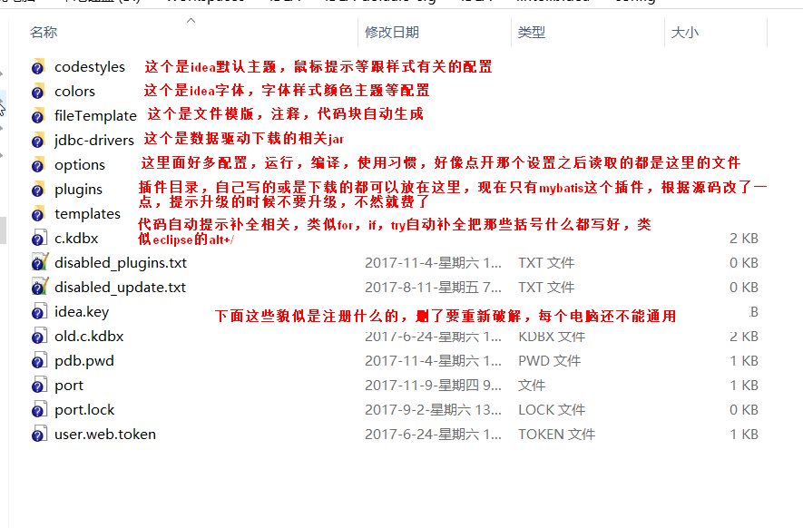
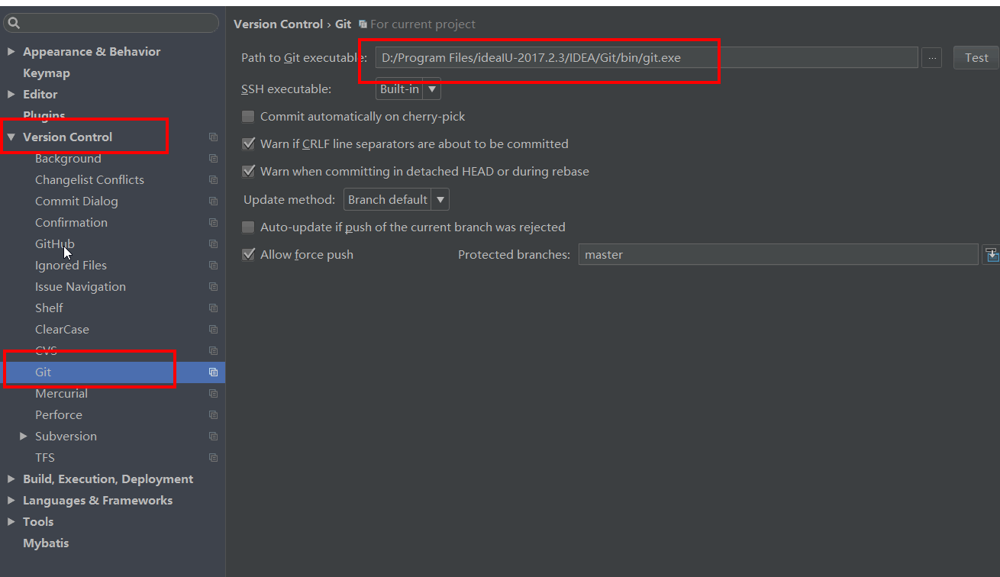
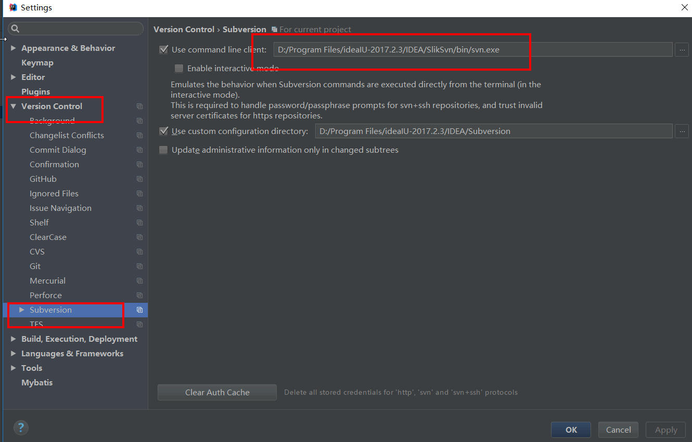
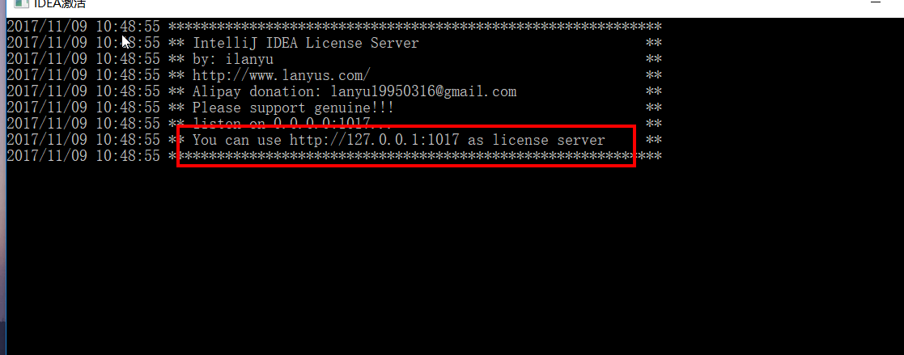
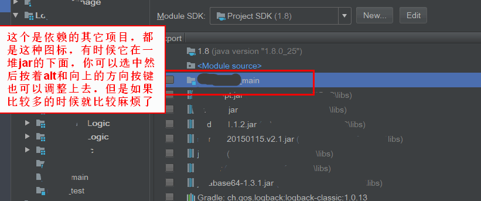

#IDEA插件文件夹文件说明
### 文件夹：.IntelliJIdea
这个文件夹是IDEA生成配置的地方，所有配置都会在这个文件夹里

### 文件夹：Git
这个是Git的命令行版本，一个版本控制软件，这不是IDEA的插件，但是要在IDEA中使用git，就必须要有这个东西，必须在IDEA中指定一个文件为git.exe的文件才行

### 文件夹：gradle
这个文件夹下是存放gradle的相关文件，你可以直接在这个地址 http://services.gradle.org/distributions/ 下载一个需要的版本，然后解压到这个目录里，然后就可以使用gradle了
### 文件夹：gradleHome
这个文件夹下是gradle下载的所有的jar文件，你可以自己选择一个文件夹，不过这个文件夹在使用一段时间之后会变得非常大，一个项目如果依赖的jar文件太多，很快这个文件夹就会上GB的存在
###文件夹：jettys
这个是一个jetty服务器，我现在里面放的是6.1.9版本，如果需要什么版本，把里面的文件都删除，然后替换你的就行
### 文件夹：SlikSvn
这个是SVN版本控制的命令行工具，同上面的git一样也是从他们官网下载的，这不是IDEA的插件，不是必须的，但是如果你要使用SVN，就要指定一个svn.exe文件，这个文件夹里的bin目录下就有，他可能不是最新的版本

### 文件夹：Subversion
这个文件夹是SVN的缓存目录，这个文件夹没有发现会变得很大，你可以使用IDEA自己默认创建的，不过我不喜欢他们在C盘创建很多东西，所以就放到这里了
### 文件：idea.properties
这个文件是IDEA64位和32位的公用文件，在IDEA的安装目录下有个bin文件夹，你可以在哪里找到这个文件，我只是在里面改了下IDEA的默认配置路径，那个路径指向这个文件夹，例如：idea.config.path=../IDEA/.IntelliJIdea/config，之所以用相对路径是因为我在IDEA的安装，目录里新建了一个文件夹名字是IDEA，这个文件夹相对IDEA.exe所在的bin文件夹就是这个相对路径
### 文件：idea64.exe.vmoptions
这个文件是IDEA的一些运行配置，启动IDEA的时候就会读取，例如里面配置了最大和最小的运行内存，当然你也可以修改bin目录下的idea.exe.vmoptions文件，那个是32位系统用的
### 文件：IDEA_reg.exe
这个是用于IDEA的破解，原理是啥我也不知道，都是百度来的，先启动IDEA，然后启动这个文件,会有黑色控制台出现，里面有个地址，粘贴到IDEA需要注册的那个地方就可以了，希望别被和谐了吧

### 文件：调整项目依赖-清除编译文件.bat
这个是自己写的一个批处理，就一行代码，java -jar orderModule.jar,这个是之前我们项目分的模块比较多，IDEA在编译的时候不知道为啥老是找不到依赖项目，后来才发现是依赖顺序问题，就写了个这个，就是读取项目目录里的.idea文件夹下的xml文件，然后修改。这个对于你的项目可能没什么用。

